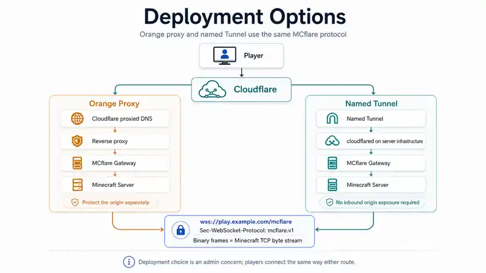

# MCflare Deployment Guide

MCflare has one network protocol and two common ways to deliver it through Cloudflare. **Orange proxy** and **named Tunnel** are administrator infrastructure choices; players connect the same way in both cases.



> The diagram is conceptual. The configuration snippets below are the authoritative examples.

## Shared contract

Whichever ingress style you choose, the public endpoint is:

```text
wss://play.example.com/mcflare
Sec-WebSocket-Protocol: mcflare.v1
```

The gateway is an ordinary HTTP/1.1 WebSocket application. It does not manage Cloudflare, DNS, certificates, ACME, Tunnel credentials, or public TLS.

```text
Cloudflare ingress → HTTP/WebSocket /mcflare → MCflare gateway → Minecraft TCP backend
```

## Which mode should I use?

| | Orange proxy | Named Tunnel |
|---|---|---|
| Best fit | Existing HTTPS reverse proxy | Outbound-only/private application ingress |
| Origin component | Traefik/Caddy/NGINX/etc. | `cloudflared` |
| Public inbound HTTPS to MCflare origin | Usually yes | Not required for the Tunnel path |
| Player changes | None | None |
| MCflare wire protocol | `/mcflare` + `mcflare.v1` | `/mcflare` + `mcflare.v1` |
| Main security concern | Protect the reachable origin | Protect Tunnel credentials and local service |

For a guided decision, read [Choose Your MCflare Setup](SETUP_CHOICES.md).

## MCflare does not manage Cloudflare

MCflare deliberately contains no:

- Cloudflare API client;
- Tunnel token or Tunnel UUID;
- DNS credential;
- `cloudflared` downloader/child process;
- certificate manager;
- ACME client.

Those belong to the administrator's infrastructure. This keeps Cloudflare-specific deployment choices out of the player mod and out of the `mcflare.v1` wire contract.

## Mode A: Cloudflare Orange proxy

Use Orange proxy when Cloudflare can reach an HTTPS reverse proxy you already control.

```text
player
  → WSS :443
  → Cloudflare proxied hostname
  → Traefik / Caddy / NGINX
  → MCflare HTTP listener
  → Minecraft
```

Routing intent:

```text
Host(play.example.com) && Path(/mcflare)
  → http://127.0.0.1:25577
```

The reverse proxy owns public TLS. MCflare itself does not need a public certificate.

### Traefik

Traefik supports WebSocket upgrade proxying without a WebSocket-specific middleware.

```yaml
http:
  routers:
    mcflare:
      rule: 'Host(`play.example.com`) && Path(`/mcflare`)'
      entryPoints:
        - websecure
      service: mcflare
      tls: {}

  services:
    mcflare:
      loadBalancer:
        servers:
          - url: http://mcflare-gateway:25577
```

Replace `mcflare-gateway:25577` with the private address Traefik can actually reach.

> If Traefik runs in a container, `127.0.0.1` refers to that container—not automatically to the Minecraft host. Use a shared container network or another private reachable address.

### Caddy

Caddy's `reverse_proxy` handles WebSocket upgrades automatically.

```caddyfile
play.example.com {
    @mcflare path /mcflare
    reverse_proxy @mcflare 127.0.0.1:25577
}
```

Use a private/container-network hostname instead of loopback when Caddy and MCflare do not share a network namespace.

### NGINX

NGINX needs the WebSocket hop-by-hop upgrade headers forwarded explicitly.

```nginx
location = /mcflare {
    proxy_pass http://127.0.0.1:25577;
    proxy_http_version 1.1;

    proxy_set_header Host $host;
    proxy_set_header Upgrade $http_upgrade;
    proxy_set_header Connection "upgrade";

    proxy_set_header CF-Connecting-IP $http_cf_connecting_ip;
    proxy_set_header CF-Connecting-IPv6 $http_cf_connecting_ipv6;
    proxy_set_header CF-Ray $http_cf_ray;
}
```

The `CF-*` values are meaningful only when this origin path is actually reached through controlled Cloudflare ingress. A directly reachable origin can receive forged look-alike headers from arbitrary clients.

### Orange origin protection

A Cloudflare-proxied DNS record does **not** by itself make the origin unreachable.

Recommended properties:

- MCflare gateway bound to loopback/private networking where possible;
- reverse proxy is the only component that can reach the gateway;
- public origin access is restricted to the intended Cloudflare path where operationally practical;
- do not expose a header-trusting gateway directly to arbitrary Internet clients;
- optional infrastructure hardening such as Authenticated Origin Pulls may be layered on the reverse-proxy path.

## Mode B: Cloudflare named Tunnel

Use a named Tunnel when inbound HTTPS access is unavailable or intentionally avoided.

```text
player
  → WSS :443
  → Cloudflare
  → named Tunnel
  → cloudflared on server infrastructure
  → MCflare HTTP listener
  → Minecraft
```

A minimal locally managed ingress example is:

```yaml
ingress:
  - hostname: play.example.com
    path: ^/mcflare$
    service: http://127.0.0.1:25577

  - service: http_status:404
```

The MCflare listener can stay on loopback because `cloudflared` is local to the server infrastructure.

MCflare does not consume the Tunnel token and does not need to know the Tunnel ID. If `cloudflared` stops, existing WebSockets can disconnect and players reconnect after the connector recovers.

### Why this is different from Cloudflare's generic TCP service mode

MCflare deliberately speaks WebSocket itself. Players therefore use ordinary WSS through the hostname and do not need a client-side `cloudflared` process for the Minecraft connection.

## Multiple Minecraft instances

Use one hostname and one MCflare listener/backend per Minecraft instance.

### Orange example

```text
survival.example.com /mcflare → 127.0.0.1:25577 → Minecraft :25565
creative.example.com /mcflare → 127.0.0.1:25578 → Minecraft :25566
modded.example.com   /mcflare → 127.0.0.1:25579 → Minecraft :25567
```

### Tunnel example

```yaml
ingress:
  - hostname: survival.example.com
    path: ^/mcflare$
    service: http://127.0.0.1:25577

  - hostname: creative.example.com
    path: ^/mcflare$
    service: http://127.0.0.1:25578

  - hostname: modded.example.com
    path: ^/mcflare$
    service: http://127.0.0.1:25579

  - service: http_status:404
```

MCflare does not duplicate hostname routing internally.

## Fabric / Quilt / NeoForge server

The server-capable mod starts the shared gateway from `config/mcflare.properties`:

```properties
enabled=true
listen=127.0.0.1:25577
max-connections=256
```

The Minecraft backend comes from the running dedicated server rather than a duplicate config value.

If the MCflare listener port is already occupied, the server logs the bind failure rather than taking down Minecraft. Choose a different per-instance gateway port.

## Paper / Purpur server

The Paper/Purpur plugin starts/stops the same shared gateway. When real player IP is required, keep:

```yaml
proxy-protocol: true
```

in the MCflare plugin config and enable the platform's native HAProxy support:

```yaml
proxies:
  proxy-protocol: true
```

A PROXY-enabled Minecraft backend should be private/firewalled so ordinary players cannot bypass MCflare and send raw Minecraft traffic where a PROXY prefix is expected.

See [Real Player IP](REAL_IP.md).

## Standalone gateway

For server software without an integrated MCflare server adapter, the Java-8-compatible gateway can be run separately:

```text
McflareGateway <listen-host:port> <minecraft-host:port> [max-connections] [proxy-protocol]
```

Use `proxy-protocol=true` only when the configured backend is prepared to consume HAProxy PROXY protocol v1.

## Security checklist

Before calling a deployment complete:

- [ ] `/mcflare` is the only MCflare route exposed for v1.
- [ ] gateway listener is loopback/private whenever infrastructure permits.
- [ ] reverse proxy/Tunnel preserves HTTP/1.1 WebSocket upgrade behavior.
- [ ] Cloudflare visitor-IP headers are trusted only through controlled ingress.
- [ ] the protected Minecraft origin is not accidentally exposed as an automatic client fallback.
- [ ] PROXY output and backend PROXY parsing are either both enabled or both disabled.
- [ ] a PROXY-enabled Minecraft backend is not publicly reachable by raw clients.
- [ ] no Tunnel token/API credential exists in MCflare configuration or client files.
- [ ] browser-interactive Access/Managed Challenge flows are not placed in front of `/mcflare`.
- [ ] separate services such as voice chat or web maps have their own security/network plan.

## Gateway operational logging

The gateway emits small structured events suitable for platform logs:

| Event | Purpose |
|---|---|
| `event=listen` | listener/backend, connection ceiling, PROXY mode |
| `event=upgrade` | session ID, forwarded-IP presence, sanitized CF-Ray correlation |
| `event=close` | session ID, duration, termination reason |
| `event=capacity-reject` | full-capacity count and configured ceiling |
| `event=error` | session ID, failure stage, exception type |

Raw forwarded player addresses are intentionally omitted from these operational events. Invalid/control-character-bearing CF-Ray values are reduced rather than copied verbatim.

## Operational validation

A healthy deployment should pass, in order:

1. hostname DNS and HTTPS/TLS resolution;
2. WebSocket Upgrade on exact `/mcflare`;
3. exact subprotocol selection `mcflare.v1`;
4. Minecraft Status through the WebSocket;
5. backend connection and PROXY parsing, if enabled;
6. full player LOGIN → CONFIGURATION → GAME;
7. one ordinary non-MCflare server regression from the same client;
8. sustained connection/reconnect behavior before production cutover.

If the sequence breaks, use [Troubleshooting](TROUBLESHOOTING.md).

## References

- [Cloudflare WebSockets](https://developers.cloudflare.com/network/websockets/)
- [Cloudflare Tunnel routing](https://developers.cloudflare.com/tunnel/routing/)
- [Cloudflare Tunnel configuration file](https://developers.cloudflare.com/tunnel/advanced/local-management/configuration-file/)
- [Cloudflare published application protocols](https://developers.cloudflare.com/cloudflare-one/networks/connectors/cloudflare-tunnel/routing-to-tunnel/protocols/)
- [Traefik WebSocket guide](https://doc.traefik.io/traefik/user-guides/websocket/)
- [Caddy `reverse_proxy`](https://caddyserver.com/docs/caddyfile/directives/reverse_proxy)
- [NGINX WebSocket proxying](https://nginx.org/en/docs/http/websocket.html)

## Related docs

- [Choose your setup](SETUP_CHOICES.md)
- [Installation](INSTALLATION.md)
- [Real player IP](REAL_IP.md)
- [Troubleshooting](TROUBLESHOOTING.md)
