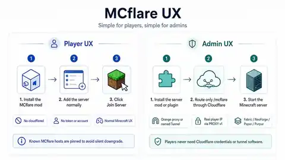

# Installation

MCflare is designed to disappear into the normal Minecraft workflow: players install a mod once and keep using **Join Server**; administrators install the server integration and publish one WebSocket path.



> The diagram is a conceptual overview. The configuration examples below are the authoritative setup instructions.

## Before you begin

You need:

- a supported Minecraft/loader/server version;
- the matching MCflare JAR;
- a hostname you control, such as `play.example.com`;
- a Cloudflare-proxied zone;
- either an HTTPS reverse proxy **or** a named Cloudflare Tunnel for `/mcflare`.

If you have not chosen an ingress style yet, read [Choose Your MCflare Setup](SETUP_CHOICES.md).

## Choose the artifact

| Environment | Install on | Artifact |
|---|---|---|
| Fabric / Quilt 1.21.11 | player + server | `mcflare-fabric-1.21.11-<version>.jar` |
| Fabric / Quilt 26.1–26.2 | player + server | `mcflare-fabric-26.1-26.2-<version>.jar` |
| NeoForge 1.21.11 | player + server | `mcflare-neoforge-1.21.11-<version>.jar` |
| NeoForge 26.1–26.2 | player + server | `mcflare-neoforge-26.1-26.2-<version>.jar` |
| Paper / Purpur | server only | `mcflare-paper-<version>.jar` |

Quilt uses the matching Fabric artifact. Paper/Purpur players still need a supported Fabric/Quilt or NeoForge client mod.

See [Compatibility](COMPATIBILITY.md) for the exact tested families and Java requirements.

## Player installation

### 1. Install the mod

Place the matching Fabric/Quilt or NeoForge JAR in the normal Minecraft `mods/` directory and launch Minecraft.

There is no player-side Cloudflare configuration.

### 2. Add the server normally

Use the ordinary Minecraft hostname:

```text
play.example.com
```

Do **not** enter a WebSocket URL, Cloudflare hostname, proxy port, or Tunnel token.

### 3. Join

Click **Join Server** exactly as you would for an ordinary server.

For an MCflare host, the mod opens the protected WebSocket internally. For an ordinary non-MCflare host, Minecraft keeps using its normal direct TCP path.

## Fabric / Quilt / NeoForge server installation

### 1. Install the same loader-family JAR

Place the matching MCflare JAR in the dedicated server's `mods/` directory.

### 2. Start the server once

MCflare creates:

```text
config/mcflare.properties
```

The main settings are:

```properties
enabled=true
listen=127.0.0.1:25577
max-connections=256
```

Keep the MCflare listener on loopback or a private interface whenever possible.

### 3. Understand the backend

The integrated Fabric/Quilt/NeoForge server adapter takes the Minecraft backend address/port from the running dedicated server. You do not need to duplicate the Minecraft port in MCflare configuration.

When real-IP forwarding is active, the local server adapter can consume the gateway's PROXY-v1 prefix and restore the visitor address before normal Minecraft decoding.

## Paper / Purpur server installation

### 1. Install the plugin

Place:

```text
mcflare-paper-<version>.jar
```

in the server's `plugins/` directory and start the server once.

### 2. Review the MCflare plugin config

The generated/default configuration includes:

```yaml
enabled: true
listen: '127.0.0.1:25577'
backend-host: '127.0.0.1'
backend-port: 0
max-connections: 256
proxy-protocol: true
```

### 3. Enable native PROXY support when required

When `proxy-protocol: true`, Paper/Purpur must also be configured to consume HAProxy PROXY protocol on the backend connection. See [Real Player IP](REAL_IP.md#paper--purpur--proxy-stacks).

Treat a PROXY-enabled Minecraft backend as private/trusted infrastructure; raw players connecting directly to that port will not speak the expected prefix.

## Route `/mcflare` through Cloudflare

Choose one ingress style for each public Minecraft hostname:

### Orange proxy

```text
player → Cloudflare → HTTPS reverse proxy → /mcflare → MCflare gateway
```

### Named Tunnel

```text
player → Cloudflare → named Tunnel → cloudflared → /mcflare → MCflare gateway
```

Both expose exactly:

```text
wss://play.example.com/mcflare
Sec-WebSocket-Protocol: mcflare.v1
```

Copy a tested Traefik, Caddy, NGINX, or Tunnel configuration from [Deployment](DEPLOYMENT.md).

## Verify the installation

A healthy setup should satisfy all of the following.

### Player path

- Minecraft can resolve the normal hostname.
- A protected host reaches LOGIN → CONFIGURATION → GAME.
- An ordinary non-MCflare server still connects normally.

### WebSocket path

- `/mcflare` reaches the gateway only through the intended ingress.
- the HTTP Upgrade returns `101 Switching Protocols`;
- the selected subprotocol is exactly `mcflare.v1`;
- there is no browser login/challenge page in front of the game path.

### Server path

- the gateway can reach the Minecraft backend;
- gateway and server agree on whether PROXY v1 is enabled;
- if real-IP forwarding is enabled, Minecraft sees the visitor address rather than the local gateway/Cloudflare edge address.

If a step fails, follow the decision tree in [Troubleshooting](TROUBLESHOOTING.md).

## Upgrading MCflare

1. Stop the affected Minecraft client/server normally.
2. Replace the JAR with the newer artifact for the same loader/version family.
3. Start Minecraft/server again.
4. Re-run a normal join and, for servers, one real-IP check if you use PROXY v1.

Do not mix Fabric and NeoForge artifacts.

## Intentionally removing MCflare from a hostname

A hostname that has positively proven MCflare is remembered on player machines to prevent silent downgrade. If an administrator intentionally converts that hostname back to ordinary raw Minecraft, affected players may need to remove that specific positive pin.

Read [Troubleshooting: A hostname was intentionally converted back to ordinary Minecraft](TROUBLESHOOTING.md#a-hostname-was-intentionally-converted-back-to-ordinary-minecraft) before doing so.

## Next steps

- [Choose your setup](SETUP_CHOICES.md)
- [Deployment](DEPLOYMENT.md)
- [Real player IP](REAL_IP.md)
- [Troubleshooting](TROUBLESHOOTING.md)
- [FAQ](FAQ.md)
