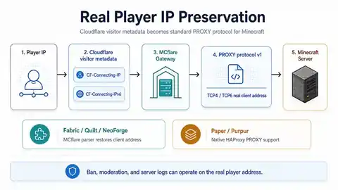

# Real Player IP Preservation

Cloudflare terminates the public WebSocket, so the Minecraft backend cannot recover the player's Internet address from the backend TCP peer alone. MCflare preserves that address by translating trusted Cloudflare visitor metadata into standard **HAProxy PROXY protocol v1**.



> This feature has a security boundary: forwarding headers are trustworthy only when the gateway is actually reached through trusted Cloudflare/reverse-proxy infrastructure.

## At a glance

```text
player address
    ↓
Cloudflare visitor metadata
    ↓
MCflare gateway validates IP literal
    ↓
PROXY TCP4 / TCP6 line
    ↓
Minecraft/server platform restores remote address
    ↓
normal Minecraft bytes continue unchanged
```

This allows native Minecraft/server tooling such as IP bans, moderation logs, and rate-limit/audit systems to operate on the restored visitor address rather than a loopback/proxy address.

## Why MCflare uses PROXY protocol

MCflare does not need a custom identity packet. The HTTP and TCP ecosystems already have standard mechanisms for carrying the information across proxy boundaries:

1. Cloudflare supplies visitor metadata on the WebSocket request.
2. MCflare validates the address.
3. MCflare emits standard HAProxy PROXY protocol v1 toward the Minecraft backend.
4. The Minecraft-side integration consumes the prefix and then receives the untouched Minecraft stream.

Real-IP handoff is **outside** the `mcflare.v1` WebSocket subprotocol. The WebSocket still carries only Minecraft TCP bytes.

## Cloudflare → MCflare

For ordinary Cloudflare HTTP/WebSocket proxying, the gateway uses:

1. non-empty `CF-Connecting-IPv6`, when present;
2. otherwise `CF-Connecting-IP`.

The selected value must be a syntactically valid IPv4 or IPv6 **literal**. MCflare does not DNS-resolve a hostname supplied in those headers.

Malformed values are rejected instead of being treated as identity.

`CF-Ray` is useful only as sanitized connection-correlation metadata. It is not player identity.

## MCflare → Minecraft

When PROXY output is enabled, the gateway prepends one PROXY-v1 line before the normal Minecraft stream.

### IPv4 shape

```text
PROXY TCP4 <real-player-ip> 127.0.0.1 <source-port> <minecraft-port>\r\n
```

### IPv6 shape

```text
PROXY TCP6 <real-player-ip> ::1 <source-port> <minecraft-port>\r\n
```

After that prefix, Minecraft bytes continue byte-for-byte.

## Source-port semantics

Cloudflare exposes the visitor **IP address** to this HTTP/WebSocket application but does not provide the original player's Internet TCP source port as equivalent application metadata.

MCflare therefore uses the available non-zero source port of the HTTP/WebSocket ingress connection as an interoperability value in the PROXY line.

The restored **IP address** is the meaningful identity. MCflare does not claim that this substituted port is the player's original Internet source port.

## Fabric / Quilt / NeoForge

The shared dedicated-server adapter integrates with Minecraft's existing connection listener.

For trusted gateway connections, it installs a small detector before normal Minecraft decoding. Loopback is always trusted; if Minecraft is explicitly bound with `server-ip`, MCflare also trusts only that exact address after verifying it belongs to a local network interface:

1. buffer only enough data to decide whether the stream starts with `PROXY `;
2. enforce the PROXY-v1 108-byte text-line maximum;
3. parse valid `TCP4` / `TCP6` source metadata with MCflare's loader-independent codec;
4. apply the source address to Minecraft's connection remote address;
5. pass the remaining bytes into the normal Minecraft pipeline.

If there is no PROXY prefix, ordinary Minecraft bytes continue untouched.

Remote direct clients do not receive this trusted-local treatment. A non-loopback exception exists only for the exact verified local address used by the integrated gateway when Minecraft itself is explicitly bound there. MCflare also avoids adding Netty's separate HAProxy codec module; the parser uses the Netty/core types already available in the server environment.

## Paper / Purpur / proxy stacks

Paper and Purpur already expose native HAProxy PROXY-protocol handling. MCflare's Paper plugin therefore does not patch the server's network pipeline just to parse the header.

Configure both sides consistently:

### MCflare plugin

```yaml
proxy-protocol: true
```

### Paper/Purpur global configuration

```yaml
proxies:
  proxy-protocol: true
```

The gateway emits PROXY v1; the server platform restores the remote address.

If MCflare fronts another Minecraft proxy such as Velocity, prefer that proxy's native HAProxy/PROXY support where available.

## Trust model

### Safe principle

Treat `CF-Connecting-IP` / `CF-Connecting-IPv6` as trusted visitor metadata only when the request path is controlled by Cloudflare/trusted reverse-proxy infrastructure.

A client can trivially invent a header named `CF-Connecting-IP` when it can reach the gateway directly.

### Named Tunnel

Recommended shape:

```text
Cloudflare → named Tunnel → local/private cloudflared → loopback/private MCflare gateway
```

The gateway does not need a public arbitrary-client listener.

### Orange proxy

Recommended shape:

```text
Cloudflare → protected HTTPS reverse proxy → private/loopback MCflare gateway
```

Protect the origin separately. A proxied DNS record does not itself make a reachable origin trustworthy.

### Minecraft-side parser

Fabric/Quilt/NeoForge trust PROXY metadata from loopback by default. When `server-ip` binds Minecraft to a specific local interface, the integrated gateway temporarily adds only that exact verified local address to the trusted source set.

Paper/Purpur native PROXY configuration effectively turns that Minecraft listener into a trusted proxy backend, so it should be private/firewalled against raw player connections.

### Multi-tenant hosts

If untrusted tenants share a host/network namespace, review local-process trust before using this model. Loopback—and an explicitly trusted local interface address—is not an authorization boundary between mutually untrusted processes sharing the same host/network namespace.

## What the gateway logs

Operational gateway events record whether a forwarded IP was present—not the raw player address itself. Sanitized CF-Ray values may be retained for correlation.

This keeps normal platform logs useful without turning MCflare's own operational logs into an unnecessary address ledger.

## Proven behavior

The current implementation has been exercised for:

- synthetic TCP4 and TCP6 PROXY-v1 paths;
- Fabric and NeoForge server integrations across the supported version families;
- Paper/Purpur native PROXY handling;
- live Cloudflare Orange and named-Tunnel full-client joins;
- external IPv6 visitor restoration;
- Minecraft native IP-ban behavior using the restored address.

Detailed test runs, redacted evidence, and exact acceptance conditions are retained in [TEST_EVIDENCE_2026-09-01.md](TEST_EVIDENCE_2026-09-01.md) and summarized in [TEST_MATRIX.md](TEST_MATRIX.md).

The repository intentionally does not publish raw test-player addresses in current documentation.

## Common failure patterns

### Minecraft disconnects immediately after backend connect

Gateway and backend probably disagree about PROXY mode. If the gateway emits `PROXY ...` but Minecraft expects a normal handshake byte, Minecraft interprets the prefix as invalid protocol data.

### Server still sees loopback/proxy address

Check that:

- Cloudflare forwarding metadata reaches MCflare;
- gateway PROXY output is enabled;
- the backend's PROXY parser/native setting is enabled;
- you are inspecting the restored Minecraft remote address rather than the gateway socket peer.

### A forged address appears possible

Treat that as an ingress-security failure. Restrict the gateway/reverse proxy path so untrusted clients cannot directly submit forwarding headers to the trusted component.

See [Troubleshooting](TROUBLESHOOTING.md#real-player-ip-is-missing-or-wrong).

## References

- [Cloudflare HTTP request headers](https://developers.cloudflare.com/fundamentals/reference/http-headers/)
- [HAProxy PROXY protocol specification](https://github.com/haproxy/haproxy/blob/master/doc/proxy-protocol.txt)
- [Paper global configuration](https://docs.papermc.io/paper/reference/global-configuration/)

## Related docs

- [Deployment](DEPLOYMENT.md)
- [Concepts](CONCEPTS.md#proxy-protocol-v1)
- [Compatibility](COMPATIBILITY.md)
- [Troubleshooting](TROUBLESHOOTING.md)
