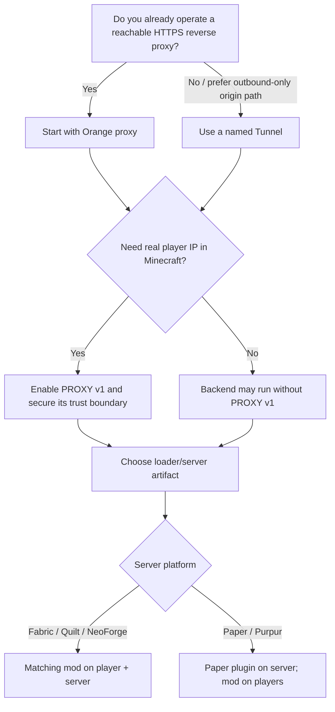

# Choose Your MCflare Setup

This guide helps server administrators choose a deployment without having to read the protocol internals first.

## The short version

| Situation | Recommended starting point |
|---|---|
| You already run Traefik, Caddy, NGINX, or another HTTPS reverse proxy | **Orange proxy** |
| You want the MCflare HTTP listener reachable only through an outbound connector | **Named Tunnel** |
| You run Fabric or NeoForge | Install the matching MCflare JAR on **player + server** |
| You run Quilt | Use the matching **Fabric** JAR on player + server |
| You run Paper or Purpur | Install **MCflare Paper plugin on server** + Fabric/Quilt/NeoForge MCflare on players |
| You need native moderation/IP bans to see the visitor address | Enable **PROXY v1** correctly |
| You host several Minecraft instances | Use **one hostname + gateway per backend** |

Both ingress choices expose the same player-facing protocol. A player never chooses “Orange mode” or “Tunnel mode.”

## Decision tree



## Orange proxy

Choose Orange proxy when:

- you already use a reverse proxy for HTTPS;
- Cloudflare can reach that origin path;
- you are comfortable applying origin firewall/private-network policy yourself;
- you want MCflare to fit into existing Traefik/Caddy/NGINX routing.

Typical path:

```text
player → Cloudflare → reverse proxy → /mcflare → gateway → Minecraft
```

### Advantages

- reuses infrastructure you may already have;
- easy to route several hostnames with an existing reverse proxy;
- no `cloudflared` process is required for this path.

### Important trade-off

A proxied DNS record is **not** itself an origin firewall. Protect the gateway/origin separately and do not trust Cloudflare forwarding headers on an arbitrary public listener.

## Named Tunnel

Choose a named Tunnel when:

- you prefer an outbound connection from the server to Cloudflare;
- inbound HTTPS access to the MCflare listener is unavailable or undesirable;
- you already operate Cloudflare Tunnel infrastructure;
- you want the application path to remain private/loopback behind `cloudflared`.

Typical path:

```text
player → Cloudflare → named Tunnel → cloudflared → /mcflare → gateway → Minecraft
```

### Advantages

- the MCflare HTTP listener does not need its own public inbound route;
- easy to bind the gateway to loopback/private networking;
- the player experience is identical to Orange proxy.

### Important trade-off

`cloudflared` becomes an infrastructure dependency on the server side. Its token, lifecycle, updates, and availability remain an administrator concern; MCflare deliberately does not manage them.

## Fabric, Quilt, and NeoForge

For these mod-loader servers, install the matching MCflare artifact on both sides:

```text
player mods/  ← same supported loader-family JAR →  server mods/
```

Quilt uses the Fabric artifact. See [Compatibility](COMPATIBILITY.md) for supported version families.

## Paper and Purpur

Paper/Purpur use a server-only MCflare plugin:

```text
player: Fabric / Quilt / NeoForge MCflare mod
server: mcflare-paper-<version>.jar
```

The plugin owns gateway lifecycle. Real-IP restoration uses Paper/Purpur's native HAProxy PROXY-protocol support.

## Do you need real player IP preservation?

Enable it if Minecraft/server-side tools need the visitor address for:

- native IP bans;
- moderation/audit logs;
- connection rate limits;
- geolocation or abuse tooling that intentionally uses IP addresses.

Do **not** enable PROXY output unless the Minecraft backend is configured to consume it. A backend that expects normal Minecraft bytes will reject a leading PROXY line.

Read [REAL_IP.md](REAL_IP.md) before enabling this path.

## Multiple Minecraft instances

Use one hostname and one gateway listener per Minecraft backend:

```text
survival.example.com → gateway A → Minecraft :25565
creative.example.com → gateway B → Minecraft :25566
modded.example.com   → gateway C → Minecraft :25567
```

Let Traefik/Caddy/NGINX/cloudflared route hostnames. MCflare intentionally does not grow a second generic router.

## What not to choose

Do not add player-side `cloudflared`, Tunnel tokens inside the mod, a VPN mode, custom Minecraft packet framing, or a generic port multiplexer to solve the basic MCflare use case. Those make the system harder without improving the v1 Minecraft transport.

## Next steps

1. [Install the correct artifacts](INSTALLATION.md).
2. [Copy the deployment configuration](DEPLOYMENT.md).
3. If needed, [configure real player IP](REAL_IP.md).
4. [Verify the setup](INSTALLATION.md#verify-the-installation).
5. Use [Troubleshooting](TROUBLESHOOTING.md) if the first connection fails.
