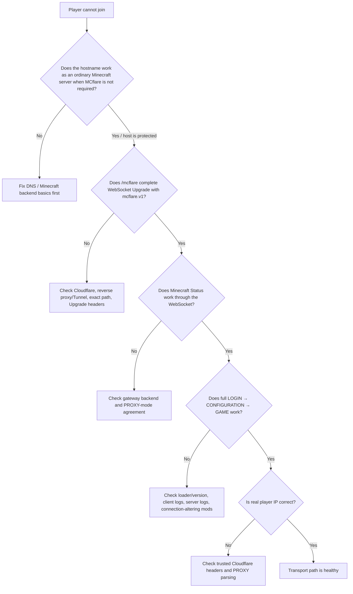

# Troubleshooting

Most MCflare failures belong to one of four layers:

1. player/client integration;
2. Cloudflare/reverse-proxy ingress;
3. MCflare gateway;
4. Minecraft backend / PROXY configuration.

Work from the outside inward rather than changing several layers at once.

## Fast diagnostic flow



## Player gets a normal connection error

Check:

- the player installed the MCflare artifact matching **both** Minecraft version family and loader;
- Fabric artifact is used for Quilt;
- Paper/Purpur plugin is not mistaken for a player mod;
- the server hostname is correct;
- client logs do not show another mod replacing the same connection hooks.

For a hostname already proven as MCflare, failure of WSS is intentionally a connection failure. The client does not silently downgrade to raw Minecraft TCP.

## `/mcflare` returns 404

The current v1 endpoint is exactly:

```text
/mcflare
```

Common causes:

- reverse proxy/Tunnel rule does not match the path;
- wrong hostname is being tested;
- request is hitting a fallback website/router;
- an old `/.well-known/mcflare` route is still being used.

`/.well-known/mcflare` is historical and is not the v1 endpoint.

## WebSocket Upgrade returns 400

Verify all of these:

- request path is exactly `/mcflare`;
- `Upgrade: websocket` reaches the gateway;
- `Connection: Upgrade` survives the proxy hop;
- client offers `Sec-WebSocket-Protocol: mcflare.v1`;
- the selected token uses the exact lowercase spelling;
- no unsupported WebSocket extension is being injected/required;
- the request is not replaced by a browser challenge/login page.

The subprotocol token is case-sensitive.

## WebSocket Upgrade returns 101 but Minecraft does not respond

This narrows the problem to gateway/backend behavior.

Check:

- configured Minecraft backend host/port;
- backend server is actually listening;
- gateway can reach it over the local/private network;
- gateway connection ceiling has not been reached;
- gateway and backend agree about PROXY protocol;
- backend is not expecting a different proxy/forwarding protocol.

The gateway opens the backend lazily when application bytes arrive, so a successful Upgrade alone does not prove the Minecraft backend is healthy.

## Upgrade succeeds but Minecraft immediately disconnects

The most common configuration error is a PROXY mismatch.

### Gateway sends PROXY, backend does not parse it

Minecraft sees the ASCII `PROXY ...` prefix where it expected its binary handshake and disconnects.

### Backend expects PROXY, gateway does not send it

The server/proxy expects a PROXY prefix but receives a Minecraft handshake instead.

Configure both sides consistently. See [Real Player IP](REAL_IP.md).

## Status works but full login fails

This means basic WSS/gateway/backend transport is already functioning.

Check:

- exact client loader/Minecraft version;
- exact server loader/server version;
- client/server MCflare artifact family;
- other mods that replace connection resolution, `Connection.connect*`, server-list pingers, or listener pipelines;
- Minecraft/server logs around LOGIN and CONFIGURATION;
- whether the problem reproduces on a minimal mod set.

Do not disable unrelated security controls or expose the origin as a first troubleshooting step.

## Ordinary non-MCflare servers stopped working

MCflare is intended to leave ordinary servers on direct Minecraft TCP.

Collect:

- hostname and Minecraft version (redact private infrastructure where appropriate);
- whether failure occurs in Multiplayer server-list Status, actual Join Server, or both;
- client MCflare log excerpt;
- connection-altering mods installed on the client.

This is a regression worth reporting because ordinary-server compatibility is a core invariant.

## Real player IP is missing or wrong

Read [REAL_IP.md](REAL_IP.md) before changing configuration.

Verify:

1. request genuinely arrived through trusted Cloudflare ingress;
2. Cloudflare visitor-IP metadata reaches the gateway;
3. gateway PROXY output is enabled when required;
4. Fabric/Quilt/NeoForge parser or Paper/Purpur native PROXY support is enabled;
5. the backend listener is not being reached directly by raw players;
6. you are checking Minecraft's restored remote address—not the gateway socket peer.

Do not solve a missing-IP problem by trusting forwarding headers on an arbitrary public listener.

## Cloudflare Orange path does not connect

Check the chain independently:

```text
DNS → Cloudflare HTTPS/WSS → origin TLS/reverse proxy → /mcflare route → gateway
```

Important checks:

- DNS record is proxied as intended;
- Cloudflare WebSockets are enabled for the zone;
- origin HTTPS/TLS is healthy;
- reverse proxy has an exact `/mcflare` rule;
- proxy preserves WebSocket Upgrade behavior;
- firewall allows the intended Cloudflare→origin path;
- gateway listener is reachable from the reverse proxy's network namespace.

Do not assume an Orange record alone firewall-protects the origin. See [Deployment](DEPLOYMENT.md#orange-origin-protection).

## Named Tunnel does not connect

Check:

- `cloudflared` process/container is healthy;
- correct Tunnel/public hostname is active;
- ingress matches exact `/mcflare` path;
- local service points to the correct MCflare listener;
- loopback means the same network namespace if containers are involved;
- Tunnel fallback rule is not catching the request first.

MCflare itself does not consume the Tunnel token.

## Connection drops during gameplay

A WebSocket/TCP transport interruption ends the Minecraft connection; MCflare does not transparently resume an already-running game session.

Check gateway `event=close` reason and duration together with:

- client network transition/drop;
- Cloudflare/Tunnel connector restart;
- reverse-proxy restart;
- Minecraft backend restart/timeout;
- gateway capacity or process restart.

A clean fresh reconnect after the underlying path recovers is the expected recovery model.

## Gateway reports capacity rejection

The gateway enforces `max-connections`.

If the configured ceiling is too low for legitimate concurrency, increase it deliberately after checking CPU/memory/file-descriptor capacity. Do not set an unbounded value merely to suppress a rejection symptom.

Unexpectedly persistent occupied slots after clients have disconnected are a lifecycle bug and should be reported with sanitized gateway logs.

## A hostname was intentionally converted back to ordinary Minecraft

Positive MCflare proof is persisted to prevent silent downgrade.

The local store is:

```text
~/.mcflare/known-hosts-v1.txt
```

Remove only the specific hostname entry if the server administrator intentionally retired MCflare for that hostname and you understand that future connections may use raw Minecraft TCP.

Do **not** clear the file simply because the MCflare service is temporarily down.

## What to include in a bug report

Include the smallest reproducible set of facts:

- Minecraft version;
- Fabric/Quilt/NeoForge/Paper/Purpur version;
- exact MCflare artifact/version;
- player loader;
- server platform;
- Orange, named Tunnel, or ordinary-direct path;
- whether `/mcflare` returns 101 with `mcflare.v1`;
- whether Status works;
- whether full GAME join works;
- whether PROXY v1 is enabled;
- smallest relevant client/server/gateway log excerpt;
- minimal mod/plugin list if another connection mod may conflict.

Do **not** include:

- Cloudflare credentials;
- Tunnel tokens;
- Minecraft/Microsoft authentication tokens;
- raw public player IP addresses;
- private keys;
- unrelated server secrets.

## Related docs

- [Installation](INSTALLATION.md)
- [Choose your setup](SETUP_CHOICES.md)
- [Deployment](DEPLOYMENT.md)
- [Real player IP](REAL_IP.md)
- [FAQ](FAQ.md)
