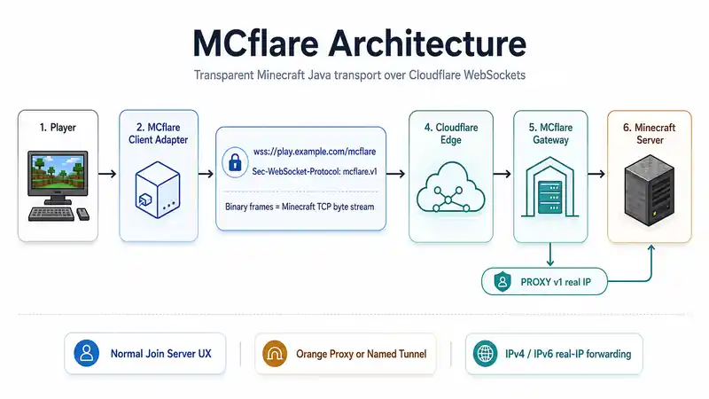

# MCflare v1 Architecture

MCflare v1 is a transparent Minecraft Java TCP ↔ WebSocket bridge. It changes the transport path without defining a second Minecraft gameplay protocol.



> The illustration is a conceptual overview. [V1_PROTOCOL.md](V1_PROTOCOL.md) is authoritative for wire behavior; this page is authoritative for the component model.

## Product statement

MCflare carries exactly one application stream: the ordered bytes of a Minecraft Java TCP connection.

It does not parse, transform, authenticate, multiplex, or understand Minecraft gameplay packets. Minecraft compression, encryption, login extensions, plugin messages, custom payloads, chunks, entities, and inventory traffic remain bytes inside the original stream.

## Architectural invariant

**Orange proxy and named Tunnel are deployment choices, not different MCflare transports.**

The client always speaks the same:

```text
wss://<minecraft-host>/mcflare
Sec-WebSocket-Protocol: mcflare.v1
```

The gateway always receives the same WebSocket byte stream and forwards to one configured Minecraft backend.

```text
Minecraft client
  → loader adapter
  → local loopback carrier
  → WSS /mcflare (mcflare.v1)
  → Cloudflare
       ├─ Orange proxy → reverse proxy ─┐
       └─ named Tunnel → cloudflared ───┤
                                       ↓
                                MCflare gateway
                                       ↓
                           optional PROXY protocol v1
                                       ↓
                                Minecraft backend
```

## Components

### 1. Loader-independent core

`core/` owns transport behavior that should not depend on Minecraft internals:

- RFC 6455/TLS WebSocket client;
- route discovery/selection;
- positive-route persistence;
- lifecycle and heartbeat handling;
- loopback carrier.

The core does not contain Orange/Tunnel modes or Cloudflare account management.

### 2. Client adapter

The loader/version adapter intercepts only the connection points MCflare needs:

- normal Join Server connection creation;
- server-list Status connection creation;
- lifecycle attachment for the local carrier.

For an ordinary server, Minecraft keeps its resolved raw TCP destination.

For a protected MCflare route, the adapter points Minecraft at the local carrier instead.

### 3. Loopback carrier

The carrier preserves Minecraft's expectation that it is connecting to a normal TCP socket.

```text
Minecraft → 127.0.0.1:<ephemeral> → MCflare carrier → remote WebSocket
```

The carrier is intentionally local and short-lived. Replacing Minecraft's entire Netty transport directly would save negligible network latency while creating substantially more loader/version coupling.

### 4. Route discovery and durable positive pins

For an unknown DNS hostname, MCflare can race protected WSS discovery against ordinary Minecraft reachability.

A successful `mcflare.v1` negotiation is **positive trust**. The client persists that hostname/logical-port pair in:

```text
~/.mcflare/known-hosts-v1.txt
```

After a positive pin exists:

- future connections bypass ordinary discovery;
- WSS is required;
- failure of WSS fails the connection closed;
- the client does **not** silently retry raw Minecraft TCP.

Only positive MCflare knowledge is durable. Ordinary/negative discovery remains short-lived so MCflare does not permanently classify normal servers from transient observations.

### 5. Cloudflare ingress

Cloudflare is the public WebSocket ingress, not an MCflare control plane.

Administrators can deliver the same `/mcflare` request through:

- ordinary proxied HTTPS/WebSocket (“Orange proxy”);
- a named Cloudflare Tunnel with external `cloudflared`.

TLS/public certificate handling, DNS, Tunnel credentials, and ingress routing remain infrastructure concerns.

### 6. MCflare gateway

The gateway:

1. accepts HTTP/1.1;
2. requires exact `/mcflare`;
3. validates RFC 6455 Upgrade requirements;
4. requires exact, case-sensitive `mcflare.v1`;
5. completes the WebSocket handshake;
6. opens the configured Minecraft backend lazily when the first application bytes arrive;
7. copies bytes bidirectionally;
8. tears down both sides when either side terminates;
9. releases the bounded connection slot.

One gateway instance maps to one Minecraft backend.

Generic hostname routing belongs to Traefik/Caddy/NGINX/cloudflared, not the gateway.

### 7. Server adapter

#### Fabric / Quilt / NeoForge

The supported server-side mod starts the local gateway and adds a minimal trusted-local PROXY-v1 detector to Minecraft's connection pipeline when real-IP restoration is enabled.

Fabric and NeoForge compile the same root Minecraft adapter source. Quilt uses the Fabric artifact.

#### Paper / Purpur

The server-only plugin starts/stops the same shared gateway. It does not patch Paper/Purpur networking to reinvent IP forwarding; native HAProxy PROXY support restores the address.

## Data path

After a successful WebSocket upgrade, binary WebSocket message payloads are concatenated into the Minecraft TCP byte stream in order.

In the other direction, bytes read from Minecraft are sent as binary WebSocket data.

There is no JSON envelope, MCflare packet ID, service multiplexer, gameplay frame, or custom compression layer.

Control frames such as WebSocket Ping/Pong/Close remain WebSocket control frames and are not delivered to Minecraft.

## Lazy backend connection

The HTTP/WebSocket side can exist briefly before Minecraft application bytes arrive.

The gateway therefore completes the WebSocket Upgrade first and opens the Minecraft TCP backend only when the first binary application bytes are received.

This lets WebSocket heartbeat/control traffic exist without unnecessarily starting Minecraft's pre-handshake timeout.

## One hostname per Minecraft backend

MCflare deliberately does not route arbitrary gameplay backends inside the protocol.

Use external hostname routing:

```text
survival.example.com → MCflare gateway A → Minecraft :25565
creative.example.com → MCflare gateway B → Minecraft :25566
modded.example.com   → MCflare gateway C → Minecraft :25567
```

This matches infrastructure that administrators already have and avoids another routing/configuration layer in MCflare.

## Real player IP boundary

Cloudflare terminates the outer WebSocket, so the gateway may validate Cloudflare visitor metadata and emit standard HAProxy PROXY protocol v1 toward Minecraft.

That real-IP handoff is **not part of `mcflare.v1`**. It is a deployment/backend concern between the gateway and Minecraft.

See [REAL_IP.md](REAL_IP.md).

## Security boundaries

- WSS protects the player-to-Cloudflare WebSocket transport.
- Minecraft's own protocol encryption/authentication remains inside the carried byte stream.
- Cloudflare visitor headers are trusted only on controlled ingress.
- Fabric/Quilt/NeoForge PROXY metadata is trusted only from the intended local gateway boundary by default.
- a PROXY-enabled Paper/Purpur backend should be private/firewalled.
- browser-interactive Access/Managed Challenge flows do not belong in front of `/mcflare`.
- MCflare stores no Cloudflare API keys, Tunnel tokens, Tunnel IDs, or DNS credentials.
- `cloudflared` lifecycle is outside MCflare.

## Failure semantics

MCflare does not attempt transparent stream resume after the underlying WebSocket/TCP connection has broken.

If the WebSocket dies:

1. the paired backend connection is closed;
2. the gateway slot is released;
3. Minecraft disconnects normally;
4. the player reconnects and begins a fresh Minecraft session.

A new WebSocket cannot safely inherit the arbitrary compression/encryption/gameplay state of an already-broken Minecraft connection.

## Deliberate non-goals

MCflare v1 does **not** provide:

- UDP or voice-chat transport;
- generic TCP tunnelling;
- arbitrary service multiplexing;
- custom Minecraft packet parsing;
- WebSocket compression;
- Cloudflare account/API management;
- certificate/ACME management;
- browser UI or account system;
- cross-connection session replay/resume;
- player-side `cloudflared`;
- Orange/Tunnel modes in the mod.

Mods using Minecraft's existing stream are carried transparently. Mods opening separate sockets remain separate network services.

## Compatibility architecture

The transport core is deliberately broader than the Minecraft integration hooks.

MCflare therefore ships thin loader/version artifacts around a shared core rather than pretending one universal binary can hook every Minecraft release safely.

See [Compatibility](COMPATIBILITY.md) and [Build matrix](BUILD_MATRIX.md).

## Validation status

The architecture has been exercised across:

- ordinary non-MCflare direct connections;
- real Fabric world joins;
- Fabric/Quilt/NeoForge/Paper/Purpur server paths;
- Orange proxy and named Tunnel;
- IPv4 and IPv6 real-IP restoration;
- native IP-ban behavior on the restored address;
- long-lived sessions and heartbeat behavior;
- client-network loss and connector restart cleanup;
- gateway capacity/lifecycle regression tests;
- public Status concurrency up to the documented synthetic scale;
- 16 simultaneous full GAME-state sessions per delivery mode plus repeated churn cohorts;
- release artifact/version/checksum dry runs.

The detailed acceptance record belongs in [TEST_MATRIX.md](TEST_MATRIX.md) and [TEST_EVIDENCE_2026-09-01.md](TEST_EVIDENCE_2026-09-01.md), not in the architecture contract.

Authenticated Mojang `online-mode=true` login is now proven through both supported Cloudflare delivery modes with the published `v1.0.0-rc.1` Fabric client. IANA registration, a naturally occurring Cloudflare-edge-initiated WebSocket termination, and larger graphical/world-generation stress remain optional future validation/formalization for this hobby project.

## Related docs

- [Concepts](CONCEPTS.md)
- [v1 wire protocol](V1_PROTOCOL.md)
- [Deployment](DEPLOYMENT.md)
- [Real player IP](REAL_IP.md)
- [Compatibility](COMPATIBILITY.md)
